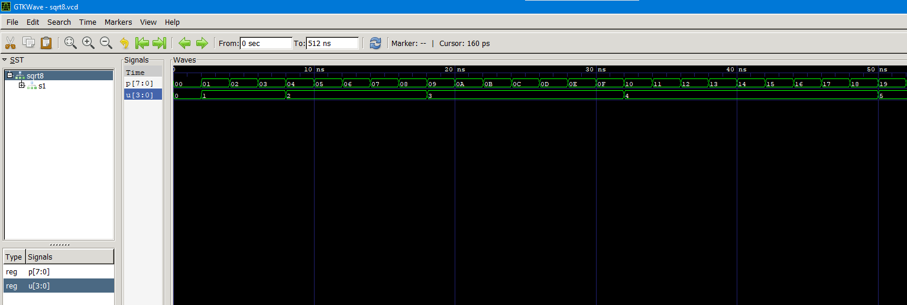
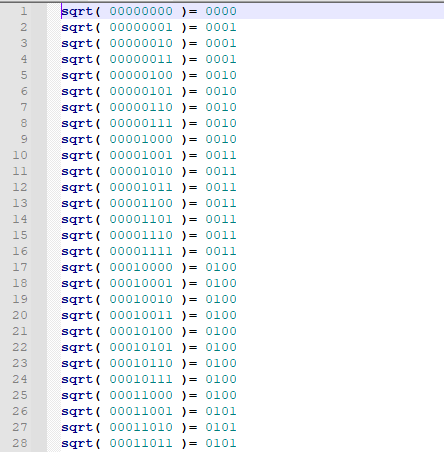

# Test Bench of [Square Root 8 Bits](../hw1)

Testbench at the end of [sqrt8.vhdl](./sqrt8.vhdl)

Source: https://www.csee.umbc.edu/portal/help/VHDL/samples/sqrt8.vhdl

---

Finding the square root of numbers from 0 to 255 with 2ns delay. Runs for 512ns.

[sqrt8.vcd](./sqrt8.vcd) shows waveform of the square root.



[sqrt8.out](./sqrt8.out) lists inputs and outputs from the square root function.



---

### How to get .vcd and .out files

In terminal, use the following commands:

`ghdl -a --ieee=synopsys sqrt8.vhdl`

`ghdl -e --ieee=synopsys sqrt8`

To get the .vcd file, use:

`ghdl -r --ieee=synopsys --stop-time=512ns > sqrt8.vcd`

To get the .out file, use:

`ghdl -r --ieee=synopsys --stop-time=512ns > sqrt8.out`

To view the .vcd file, use GTKWave:

`gtkwave ./sqrt8.vcd`

To view the .out file, use:

`cat sqrt8.out`

If the argument `--ieee=synopsys` is not used in the above commands, you will get an error stating
```
sqrt8.vhdl:87:10: unit "std_logic_textio" not found in library "ieee"
sqrt8.vhdl:87:10:  (use --ieee=synopsys or --std=08 for this non-standard synopsys package)
sqrt8.chdl:93:22: entity 'sqrt8' was not analyzed
```