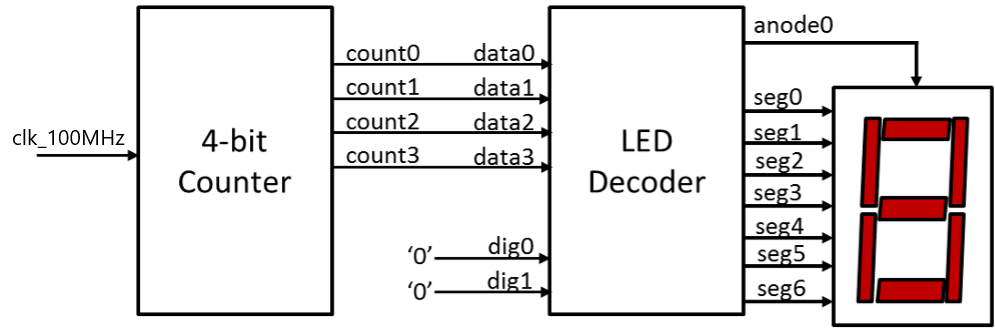

# Lab 1

## LED Decoder \([leddec](./leddec)\)

Objective: Build a single-digit (4 bit) hexadecimal number to display its value on an 8 digit common anode 7 segment LED display.


Seven segment is represented as "ABCDEFG" where a 1 is off and a 0 is on.
```
0000001 = 0
1001111 = 1
0010010 = 2
0000110 = 3
1001100 = 4
0100101 = 5
0100000 = 6
0001111 = 7
0000000 = 8
0001100 = 9
0001000 = A
1100000 = b
0110001 = C
1000010 = d
0110000 = E
0111000 = F
```

## Single Digit Hex Counter \([hexcount](./hexcount)\)

Objective: Build a 4 bit counter to dispay a hex character.



A 29 bit signal is created and incremented by a 100MHz clock.

The final 4 bits (bits 25 to 28) are extracted and used to display a hexadecimal digit on the LED display.

Because the input clock is running at 100MHz, the 25th bit is incremented at a rate of 100MHz/2<sup>25</sup> ≈ 2.98 Hz ≈ 0.34 s

This means a complete cycle would take (2<sup>29</sup>/2<sup>25</sup>)/2.98 = 2<sup>4</sup>/2.98 = 16/2.98 ≈ 5.37 s