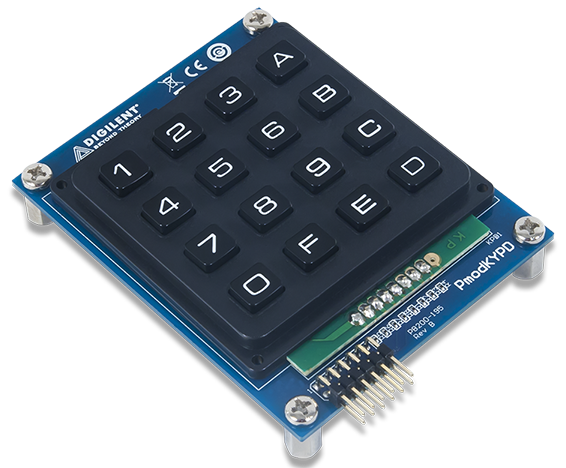

# Hexadecimal Calculator

Objectives: Program a simple hexadecimal calculator capable of adding two 4 digit hexadecimal numbers using a 16 button keypad module. Connect the keypadd to port JA with VDD/GND facing up on both ends.

