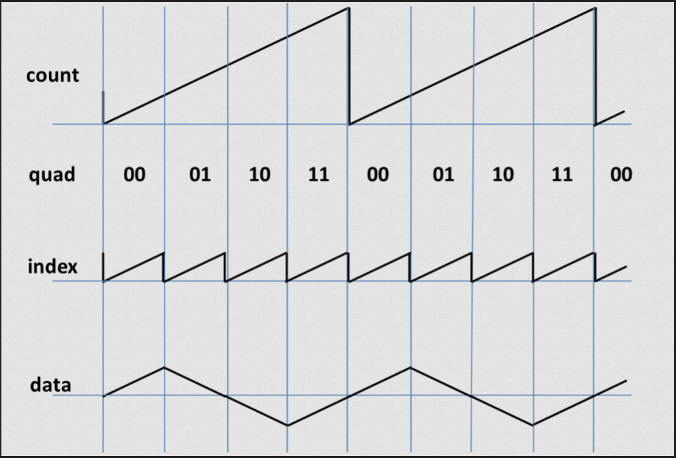

# Lab 5: Siren

Objectives: Program a wailing audio siren using a 24 bit Digital to Analog converter called Pmod I2S to the top 6 pins of port JA. Connect a set of headphones or a speaker to the audio jack on the DAC.

**WARNING: THE SIREN IS LOUD**

Generate a triangle wave to be played over the speaker.

